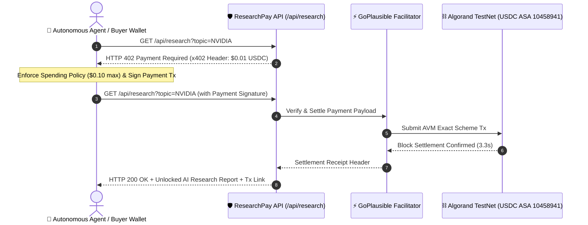

# 🔬 ResearchPay Agent

> **Autonomous AI Research API with x402 Micro-USDC Payments on Algorand**

[](https://testnet.explorer.perawallet.app/)
[](https://docs.x402.org)
[](https://faucet.circle.com)
[](https://www.typescriptlang.org/)
[](LICENSE)

**ResearchPay Agent** is an agentic commerce service built on Algorand. It enables autonomous AI agents to purchase real-time, specialized AI research intelligence reports on a pay-per-query basis using the **x402 open HTTP micropayment protocol** and **Algorand TestNet USDC**.

---

## ⚡ Problem & Vision

Traditional API access requires human account creation, credit card subscriptions, and centralized API keys—creating friction for autonomous AI agents. 

**ResearchPay Agent** removes all human friction by enabling **machine-native payment rails**:
1. Agents discover the endpoint and receive an `HTTP 402 Payment Required` challenge.
2. Agents evaluate spending policies before signing a **$0.01 USDC** transaction on Algorand.
3. The **GoPlausible facilitator** verifies and settles the payment on-chain in 3.3 seconds.
4. The server delivers live-synthesized AI research with real-time web citations and verifiable settlement receipts.

---

## 🏗️ System Architecture



---

## ✨ Key Features

- 🔍 **Real-Time Knowledge Engine**: Dynamically fetches and synthesizes live intelligence from Wikipedia Knowledge REST API and DuckDuckGo for any requested topic (`NVIDIA`, `Quantum computing`, `Algorand`, `Solana`, `AI Agents`, etc.).
- 🛡️ **x402 Protocol Compliant**: Full implementation of the x402 HTTP standard with `HTTP 402` challenges, base64url header parsing, and receipt verification.
- 💰 **Machine-Native Micro-USDC Pricing**: Fixed **$0.01 USDC** price per research request on Algorand TestNet (ASA `10458941`).
- 🔐 **Spending Policy Enforcement**: Built-in client spending cap ($0.10 max budget) preventing runaway agent spending.
- 🎨 **Interactive Web Dashboard**: Glassmorphism UI featuring live 5-step timeline tracking, budget cards, and direct links to Pera Explorer transaction receipts.
- 🔒 **Zero-Trust Wallet Security**: Private keys (`CLIENT_MNEMONIC`) are kept strictly local in `.env`. Server receiver requires only a public `PAY_TO_ADDRESS`.

---

## 🚀 Quickstart Guide

### 1. Prerequisites

- **Node.js**: v20 or higher
- **pnpm** (or `npm`)
- **Algorand TestNet Wallets**:
  - **Buyer Wallet**: Needs TestNet ALGO for fees + TestNet USDC (ASA `10458941`).
  - **Receiver Wallet**: Needs public address opted into USDC ASA `10458941`.

### 2. Installation

```bash
git clone https://github.com/SomehowLiving/x402-commerce-template.git researchpay-agent
cd researchpay-agent
pnpm install
```

### 3. Environment Setup

Copy `.env.example` to `.env`:

```bash
cp .env.example .env
```

Configure your local `.env`:

```env
PORT=3000
API_BASE_URL=http://localhost:3000
ALGORAND_NETWORK=testnet

# RECEIVER / SERVICE WALLET (Public Address Only)
PAY_TO_ADDRESS=WT5667IIQY3ONNBA6BKUGVYGRM52GNILV453KJLE4NOA7YAD6PCW6IJBK4

# BUYER / AGENT WALLET
WALLET_ADDRESS=NZJKOPEAQ5OV2QMYXMOECLMMG2WOQVXDQ2S5IPTWKXQ54GOMWOXYUSJAMI

# BUYER SECRET CREDENTIAL (Stored safely local only)
CLIENT_MNEMONIC="your 25 word testnet buyer mnemonic phrase"

FACILITATOR_URL=https://facilitator.goplausible.xyz
PRICE_USDC=$0.01
DEMO_MODE=true
```

---

## 🏃 Running the Application

### Start Development Server & UI

```bash
pnpm dev
```
Open **`http://localhost:3000`** in your browser to interact with the ResearchPay Agent dashboard.

### Execute Unpaid Client Request (HTTP 402 Challenge)

```bash
pnpm client:unpaid
```

### Execute Paid Client Request (Real On-Chain Settlement)

```bash
pnpm client:paid
```

### Run Full Payment Simulator

```bash
pnpm simulate
```

---

## 🧪 Testing & Verification

Run the full suite of unit tests, smoke tests, and x402 protocol checks:

```bash
# Unit Tests
pnpm test

# Smoke Test
pnpm smoke

# Build Verification
pnpm build

# x402 Protocol Inspection
pnpm x402 inspect
```

---

## 🔗 Useful Links & Resources

- **Algorand TestNet Faucet**: [lora.algokit.io/testnet/fund](https://lora.algokit.io/testnet/fund)
- **Circle USDC TestNet Faucet**: [faucet.circle.com](https://faucet.circle.com)
- **Algorand Pera Explorer**: [testnet.explorer.perawallet.app](https://testnet.explorer.perawallet.app/)
- **GoPlausible Facilitator**: [facilitator.goplausible.xyz](https://facilitator.goplausible.xyz)
- **x402 Protocol Docs**: [docs.x402.org](https://docs.x402.org)

---

## 📄 License

This project is licensed under the [MIT License](LICENSE).
